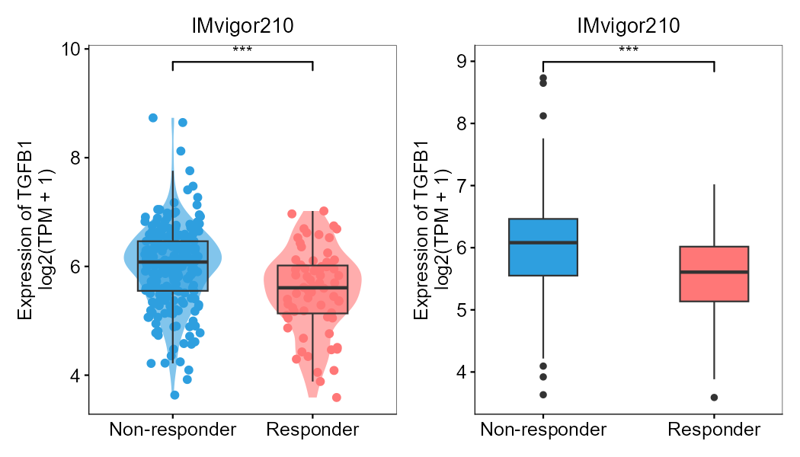
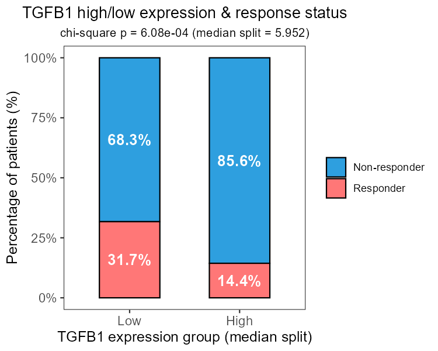
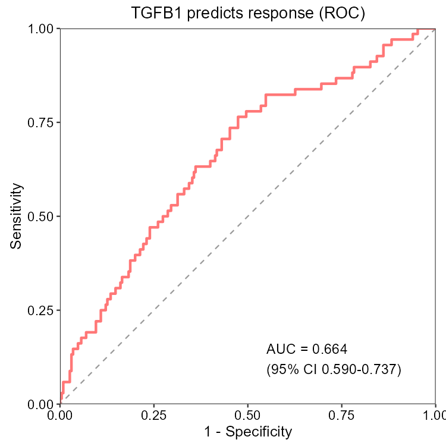
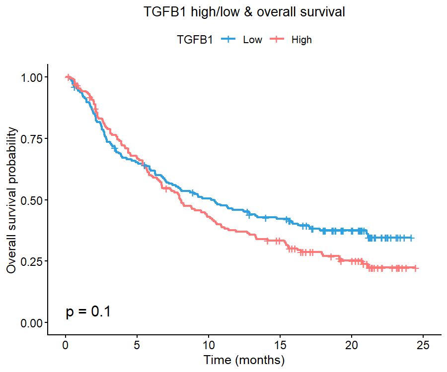
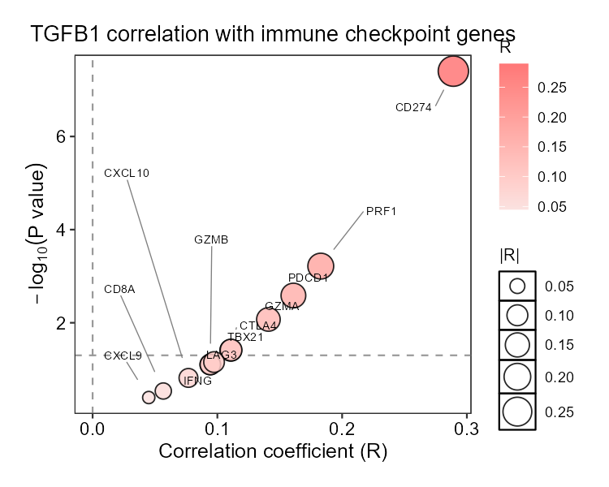
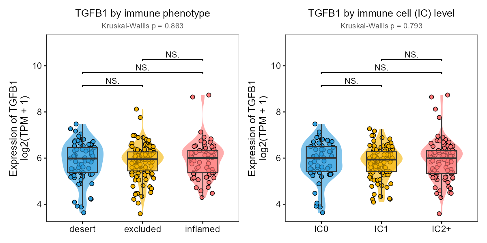

# IMvigor210CoreBiologies

> A maintained, installable build of the *IMvigor210* core biology R package — works on modern R (≥ 3.3, tested on 4.6.1) and current Bioconductor, **without the dead `DESeq` dependency** that breaks the original release.

The package contains the data and analysis code that accompany the manuscript:

> Mariathasan *et al.*, **TGF-β attenuates tumor response to PD-L1 blockade by contributing to exclusion of T cells.** *Nature* (2018).  
> (Atezolizumab / anti–PD-L1 in metastatic urothelial cancer, the IMvigor210 trial.)

---

## Why this build exists

The original package (v1.0.0, 2019-02-11) no longer installs on modern R because of two stale dependencies:

1. **`DESeq`** — declared in `DESCRIPTION` `Imports`, but the legacy `DESeq` package was **removed from Bioconductor (3.13)** and can no longer be installed. This alone makes `R CMD INSTALL` fail before anything runs.
2. **`lsmeans`** — archived on CRAN (superseded by `emmeans`); it was only used by the optional mouse-imaging scripts, yet it also blocked installation.

Crucially, **the package code never actually calls the old `DESeq`** — only the bundled `data/cds.RData` was serialized as the legacy `CountDataSet` S4 class. This build fixes both the dependency declaration and the data object so the package installs and works out of the box.

---

## What changed vs. the original package

| Aspect | Original (2019) | This build |
|--------|-----------------|------------|
| `DESCRIPTION` `Imports` | `DESeq`, `lsmeans`, … | `DESeq` **removed**; `lsmeans`→`emmeans` moved to `Suggests`; `SummarizedExperiment`, `S4Vectors` added |
| `data/cds.RData` class | `CountDataSet` (needs dead `DESeq`) | **`DESeqDataSet`** (modern, standards-compliant) |
| Accessors | `counts` / `pData` / `fData` | `counts`/`colData`/`rowData`/`assay`/`assays`/`metadata` **re-exported**; legacy `pData`/`fData` auto-mapped via `.onLoad` |
| Vignette / docs | reference `biocLite()`, `DESeq`, `CountDataSet` | `BiocManager::install()`, `DESeq2`, `DESeqDataSet` |
| `inst/analysis` mouse imaging | uses `lsmeans` | uses `emmeans` |
| Installable on R 4.x | ❌ | ✅ (verified `R CMD INSTALL` + `data(cds)`) |

The bundled dataset itself is unchanged in content — same 31,286 features × 348 samples, same 25-column clinical annotation — it is just stored in a modern container class.

---

## Installation

**Prerequisites:** R ≥ 3.3 (tested 4.6.1) and the Bioconductor dependencies below.

```r
# 1. Install Bioconductor dependencies (one time)
if (!requireNamespace("BiocManager", quietly = TRUE))
  install.packages("BiocManager")
BiocManager::install(c("Biobase", "DESeq2", "SummarizedExperiment",
                      "S4Vectors", "biomaRt", "edgeR", "limma"))
```

**Option A — from GitHub (recommended):**

```r
# install.packages("devtools")
devtools::install_github("BioInfoCloud/IMvigor210CoreBiologies")
```

**Option B — clone + source install:**

```bash
git clone https://github.com/BioInfoCloud/IMvigor210CoreBiologies.git
R CMD INSTALL IMvigor210CoreBiologies
```

> Tip: if you only need the expression + clinical matrix and prefer a modern `SummarizedExperiment`, see the [`easierData`](#alternative-easierdata) alternative below.

---

## Usage

```r
library(IMvigor210CoreBiologies)
data(cds)

class(cds)                       # "DESeqDataSet"
dim(counts(cds))                # 31286 features x 348 samples
dim(colData(cds))               # 348 x 25   (was pData)
dim(rowData(cds))               # 31286 x 6  (was fData)

# Legacy accessors still work unchanged (auto-registered on load):
pData(cds)                      # identical to colData(cds)
fData(cds)                      # identical to rowData(cds)

# Drop straight into a modern DESeq2 workflow:
suppressMessages(library(DESeq2))
dds <- estimateSizeFactors(cds) # 348 finite size factors
```

Key clinical columns in `colData(cds)` include `binaryResponse`
(`"CR/PR"` = responder, `"SD/PD"` = non-responder, `NA` = not evaluable / `NE`),
`Best Confirmed Overall Response`, `Immune.phenotype` (`desert` / `excluded` / `inflamed`),
`IC.Level` (`IC0` / `IC1` / `IC2+`), `TC.Level`, `os`, and `censOS`.

---

## Biomarker helper functions (new in v1.1.0)

Version 1.1.0 bundles a small, self-contained toolkit that turns the bundled
`cds` into publication-ready biomarker figures with one or two lines of code.
Every function returns a **ggplot2 / survminer object** (so you can keep editing
it) and attaches the key statistic as an attribute. Expression is computed as
`log2(TPM + 1)` with an edgeR TMM / CPM low-expression filter, identical to the
reference `RNH1分析.R` script.

### Quick reference

| Function | What it produces | Returned statistic (attribute) |
|----------|------------------|-------------------------------|
| `IMMUNE_CHECKPOINT_GENES` | 12-gene immune panel constant | — |
| `get_tpm_expression(cds, genes)` | `log2(TPM+1)` matrix | — |
| `plot_expression_by_response(cds, gene)` | violin + boxplot by response | `p.value` (Wilcoxon) |
| `plot_checkpoint_correlation(cds, gene)` | correlation "volcano" vs checkpoints | `table` (per-gene R / p) |
| `plot_response_proportion(cds, gene)` | stacked % bar, high/low × response | `chisq_p`, `counts` |
| `plot_gene_heatmap(cds, genes)` | row-scaled heatmap, response-ordered | writes file / returns pheatmap obj |
| `plot_roc_response(cds, gene)` | ROC curve for response | `auc`, `ci` |
| `plot_survival(cds, gene, by =)` | KM by expression or response | `pvalue` (log-rank) |
| `plot_immune_context(cds, gene)` | violins by phenotype & IC level | `kruskal_p` |
| `run_biomarker_report(cds, gene)` | all of the above + tables, to disk | `plots`, `summary` |

### Worked example — TGFB1 (TGF-β1)

`TGFB1` encodes transforming growth factor β1. It is the signature gene of the
IMvigor210 biomarker paper (Mariathasan *et al.*, 2018, *Nature*:
"TGFβ attenuates tumour response to PD-L1 blockade by contributing to
exclusion of T cells"), and it is **not** an immune-checkpoint gene — a good
illustration that the toolkit works for any literature-supported gene, not just
checkpoints such as PD-L1.

```r
library(IMvigor210CoreBiologies)
data(cds)

gene <- "TGFB1"                       # TGF-β1 from the original IMvigor210 paper

# 1. Expression matrix (log2(TPM+1)); reuse it to avoid recomputing
expr <- get_tpm_expression(cds)

# 2. Expression in responders vs non-responders
p1 <- plot_expression_by_response(cds, gene, expr = expr)
p1$p.value                          # 4.19e-05 (Wilcoxon)

# 3. Correlation with the 12 immune-checkpoint genes
p2 <- plot_checkpoint_correlation(cds, gene, expr = expr)
attr(p2, "table")                   # per-gene Pearson R and p

# 4. High/low expression vs response composition
p3 <- plot_response_proportion(cds, gene, expr = expr)
attr(p3, "chisq_p")

# 5. Row-scaled heatmap (target + checkpoints), all samples
plot_gene_heatmap(cds, c(gene, IMMUNE_CHECKPOINT_GENES),
                  expr = expr, outfile = "TGFB1_heatmap.pdf")

# 6. ROC for response prediction
p6 <- plot_roc_response(cds, gene, expr = expr)
attr(p6, "auc")                     # 0.664 (95% CI 0.59-0.737)

# 7. Kaplan-Meier by expression level
p7 <- plot_survival(cds, gene, by = "exprGroup", expr = expr)
attr(p7, "pvalue")                  # 0.10 (log-rank)

# 8. Immune-microenvironment context
p8 <- plot_immune_context(cds, gene, expr = expr)
p8$kruskal_p                        # 0.86 (phenotype), 0.79 (IC level)

# 9. One call to render AND save everything
rep <- run_biomarker_report(cds, gene, outdir = "Results/TGFB1")
rep$summary                        # tidy data.frame of all metrics
```

#### Real figures generated on IMvigor210

| Expression by response | High/low × response |
|:--:|:--:|
|  |  |
| Wilcoxon **p = 4.19 × 10⁻⁵**; responders express TGFB1 at lower levels. | Median-split χ² **p = 6.1 × 10⁻⁴**; high TGFB1 is enriched for non-responders (85.6% vs 68.3%). |

| ROC | Overall survival by expression |
|:--:|:--:|
|  |  |
| AUC = **0.664** (95% CI 0.590–0.737). | Log-rank **p = 0.10**; high TGFB1 trends toward poorer survival. |

| Checkpoint correlation | Immune context |
|:--:|:--:|
|  |  |
| Correlations are weak overall (max |R| ≈ 0.29 vs CD274), but become significant because of the large sample size (n = 298). | No difference across annotated immune phenotype or IC level (Kruskal–Wallis p = 0.86 and 0.79), suggesting that steady-state TGFB1 mRNA alone is not a simple proxy for the excluded phenotype. |

> `run_biomarker_report()` writes the same eight-folder figure + table layout as
> the standalone UBA52 script (`expr_diff/`, `correlation/`, `group_proportion/`,
> `heatmap/`, `survival/`, `roc/`, `immune_context/`, `tables/`).

---

## Migrating old code

- Scripts using **`pData(cds)` / `fData(cds)`** work **with no changes** (mapped automatically).
- `countDataSet` references in old documentation/vignettes should be read as **`DESeqDataSet`**.
- `library(lsmeans)` calls in the mouse-imaging analysis are now `library(emmeans)`.

A full technical repair log is in [`REPAIR_IMvigor210.md`](REPAIR_IMvigor210.md).

---

## Worked example: UBA52 as an immunotherapy biomarker

A companion analysis script (`analyze_biomarker_UBA52.R`, kept alongside this package in the
project workspace) demonstrates an end-to-end biomarker workflow on this dataset:

1. **Expression by response** — violin + boxplot of target gene in responders vs. non-responders (Wilcoxon).
2. **Correlation with 12 immune-checkpoint genes** — scatter / heatmap.
3. **High/low expression × response** — proportion bar chart.
4. **Response-stratified expression heatmap** (target + checkpoints, row-scaled).
5. **ROC** for response prediction (AUC).
6. **Kaplan–Meier** by expression level and by response.
7. **Immune context** — expression across immune phenotypes and intratumoral (IC) levels.

It uses **TPM** normalization (consistent with the reference `RNH1分析.R`) and applies cohort-aware sample selection (see `Results/UBA52/sample_selection_README.txt`). The dataset provided by *this* package is exactly what that analysis consumes.

---

## Alternative: `easierData`

If you only want the data in a modern object and don't need this package's helper functions,
Bioconductor's [`easierData`](https://bioconductor.org/packages/easierData/) provides the same
source cohort as a standard `SummarizedExperiment`:

```r
BiocManager::install("easierData")
library(easierData); library(SummarizedExperiment)
se <- get_Mariathasan2018_PDL1_treatment()
assay(se); as.data.frame(colData(se))
```

Note: `easierData` is derived from the same paper but trims some clinical annotations.

---

## Notes

- The `cds` object is ~16 MB; it is committed in `data/` so `data(cds)` works offline after install.
- This is a **maintenance build** of the original Genentech-authored package; all credit for the
  underlying data and science belongs to Mariathasan *et al.* / the original authors.
- Maintained and re-published by **BioInfoCloud**, who is listed as an author of this fork in
  `DESCRIPTION` (see the `Author:` field).
- Network note for CI: the package itself has no external runtime dependencies beyond Bioconductor.
- **v1.1.0** adds the biomarker helper functions (see *Biomarker helper functions* above): `get_tpm_expression()`, the `plot_*` family, `IMMUNE_CHECKPOINT_GENES`, and `run_biomarker_report()`.

## License

Distributed under the original package license — see [`LICENSE`](LICENSE).
